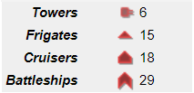
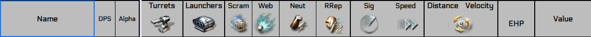
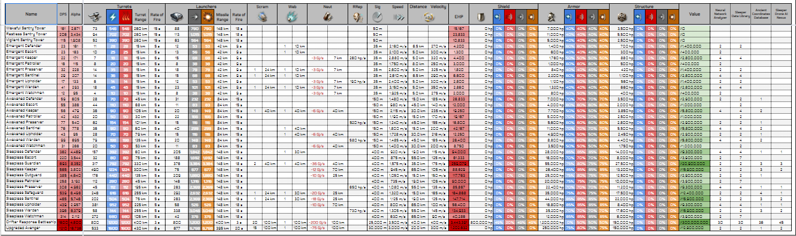
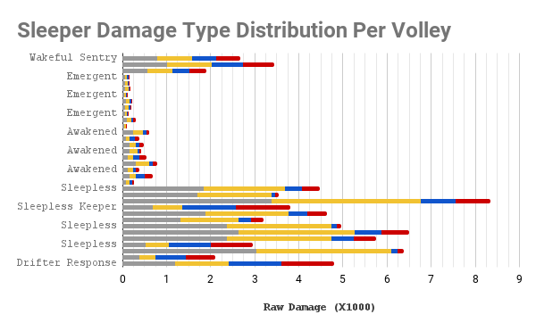

// A markdown file.
# 🌌 PhobiaCide's Modified Rykki's Wormhole Guide

<br>

👨‍🚀 This Published Google Sheets work book lists all **Eve Online** *wormhole sites* along with the *sleepers* you will find there.

🛸 It also provides important information regarding **potential damage output** of each wave and what types of electronic warfare might be deployed against a would-be site-runner.

🛰 **It is a must have for wormhole life and especially for those just starting out**. Using this guide, a capsuleer would have advance intelligence on the dangers of each site.

Know beforehand:

+ 🔮 If your ship and fit can handle a particular site
+ 💎 The ISK value of a particular ore field
+ ☁️ Which gas cloud is best to huff first
+ ⏱ Best possible site time under ideal conditions

<br>

## 🌠 Details

---

## I Redesigned Front End

### 1. 🚀 Ship Icons

<details>

  <summary>🎯 Example Of Icons Used In the Guide</summary>



</details>

<br>

### 2. ☄️ Aesthetic and Engaging Graphical Table

<details>

  <summary>🍭 A Peek At Graphical Elements Used</summary>



</details>

<br>

---

## II Up-To-Date Back End

### 1. 👽 Data for calculating sleeper engagement profile is updated every day

<details>

  <summary>📉 View Chart</summary>

  

### Some Key Figures From The Chart:

|Figure|Definition|
|------|----------|
|Scram|Points of scram and range|
|Web|Quantity of webs and optimal range|
|Neut|Rate of capacitor neutralization and optimal range|
|RRep|Rate of remote repair and optimal range|
|Sig|The signature radius of the ship|
|Speed|The sleeper's top speed when not at orbit range|
|Distance|The sleeper's preferred distance at which to orbit|
|Velocity|The speed the sleeper will burn while orbiting|

</details>

<br>

### 2. 📈 Market data for all relevant types is updated every hour

<details>

  <summary>🧮 Example Market Data</summary>

  

</details>

<br>

### 3. ⚠️ Sleeper Damage Graph

<details>

<summary>📊 Check It Out</summary>

The following graph is included in the guide and is actively calculated based on the data received from esi.evetech.net.



</details>

<br>

---

## III Acknowledgements

<details>

<summary>Thanks to Fuzzy Steve for maintaining a market database and for writing loadRegionAggregates()</summary>

```js
/**
 * @alias loadRegionAggregates()
 * @function
 * @description Requests aggregated market data from market.fuzzwork.co.uk for a given list of type Ids
 * @param {array} dirtyTypeIds
 * @param {(number | string)} [regionId = 10000002]
 * @throws Will throw an error if dirtyTypeIds is undefined
 *
 * @returns
 */
function loadRegionAggregates(dirtyTypeIds, regionId = 10000002) {
  try {
    if (typeof dirtyTypeIds == `undefined`) {
      throw `Need a list of typeids`;
    }

    const prices = [];
    const cleanTypeIds = [];

    const url = `https://market.fuzzwork.co.uk/aggregates/?region=${regionId}&types=`;
    const options = { method: `get`, payload: `` };

    dirtyTypeIds.forEach(row => {
      row.forEach(cell => {
        if (typeof cell === "number") {
          cleanTypeIds.push(cell);
        }
      });
    });

    prices.push([
      "Buy volume",
      "Buy Weighted Average",
      "Max Buy",
      "Min Buy",
      "Buy Std Dev",
      "Median Buy",
      "Percentile Buy Price",
      "Sell volume",
      "Sell Weighted Average",
      "Max sell",
      "Min Sell",
      "Sell Std Dev",
      "Median Sell",
      "Percentile Sell Price",
    ]);

    function spliceChunks(array, chunkSize) {
      const result = [];
      while (array.length > 0) {
        const chunk = array.splice(0, chunkSize);
        result.push(chunk);
      }
      return result;
    }

    const chunkSize = 100;
    const chunkedArray = spliceChunks(cleanTypeIds, chunkSize);
    chunkedArray.forEach(chunk => {
      Utilities.sleep(Math.random() * 200);
      const urlTypes = chunk.join(",").replace(/,$/, "");
      const json = JSON.parse(
        UrlFetchApp.fetch(url + urlTypes, options).getContentText(),
      );
      if (json) {
        chunk.forEach(entry => {
          const price = [
            parseInt(json[entry].buy.volume),
            parseInt(json[entry].buy.weightedAverage),
            parseFloat(json[entry].buy.max),
            parseFloat(json[entry].buy.min),
            parseFloat(json[entry].buy.stddev),
            parseFloat(json[entry].buy.median),
            parseFloat(json[entry].buy.percentile),
            parseInt(json[entry].sell.volume),
            parseFloat(json[entry].sell.weightedAverage),
            parseFloat(json[entry].sell.max),
            parseFloat(json[entry].sell.min),
            parseFloat(json[entry].sell.stddev),
            parseFloat(json[entry].sell.median),
            parseFloat(json[entry].sell.percentile),
          ];
          prices.push(price);
        });
      }
    });
  } catch (error) {
    // TODO (developer) Handle Exception
    console.error(
      `loadRegionAggregates() failed with error: ${error.message}.`,
    );
  } finally {
    return prices;
  }
}
```

</details>

<br>

---

## IV 🪐 Link To The Guide

[🔗 Click here]("https://docs.google.com/spreadsheets/d/e/2PACX-1vSskkG0Lr8YTU1Qz1XrXGlIpqnHZsJePh9ipr1e2qUsmfVu8tzn0NNzAOeM7_omWbHxzWtQ5gO7V1SH/pubhtml") to see the wormhole guide!

<br>

---

<div align="center"><h6>Made with 🔥 by PhobiaCide</h6></div>
