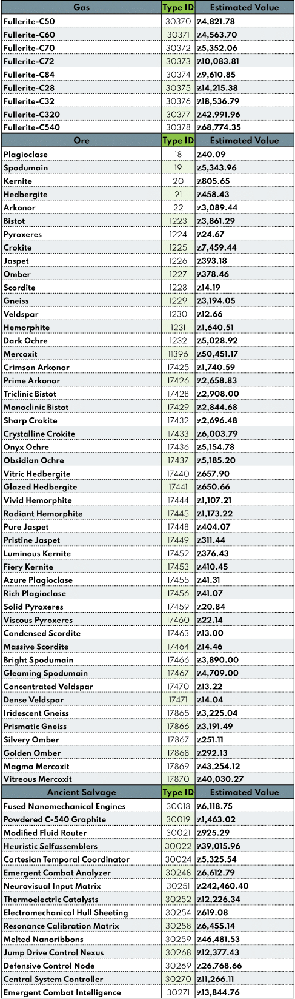

# PhobiaCide's Wormhole Guide

## Based on Rykki's Wormhole Guide

---

## Features

### Redesigned front end

#### 1. Ship Icons
  

#### 2. Aesthetic and engaging graphical tables

---

### Up-to-date back end

#### 1. Sleeper data for calculating DPS, EHP, and engagement profile is updated every day

#### 2. Market data for all relevant types is updated every hour

#### 3. Cool Chart!

## Link To The Guide

[Click here]("https://docs.google.com/spreadsheets/d/e/2PACX-1vSskkG0Lr8YTU1Qz1XrXGlIpqnHZsJePh9ipr1e2qUsmfVu8tzn0NNzAOeM7_omWbHxzWtQ5gO7V1SH/pubhtml") to see the wormhole guide!

---

<h6>Made with 🖤 by PhobiaCide</h6>
